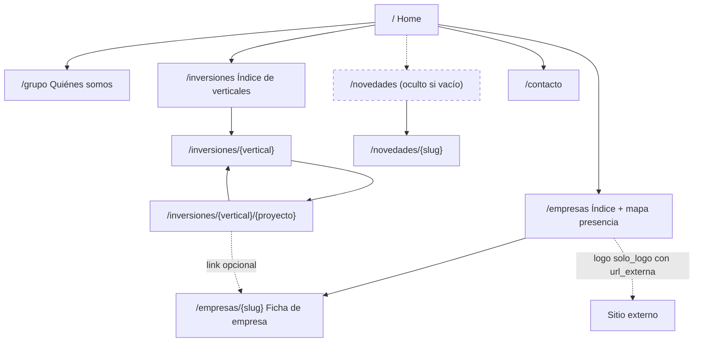

# Mapa de pantallas — Grupo GEN

```mermaid
graph TD
    Home["/ Home"]
    Grupo["/grupo Quiénes somos"]
    EmpresasIdx["/empresas Índice + mapa presencia"]
    EmpresaFicha["/empresas/{slug} Ficha de empresa"]
    InvIdx["/inversiones Índice de verticales"]
    Vertical["/inversiones/{vertical}"]
    Proyecto["/inversiones/{vertical}/{proyecto}"]
    NovedadesIdx["/novedades (oculto si vacío)"]
    Novedad["/novedades/{slug}"]
    Contacto["/contacto"]

    Home --> EmpresasIdx
    Home --> InvIdx
    Home -.-> NovedadesIdx
    Home --> Contacto
    Home --> Grupo

    EmpresasIdx --> EmpresaFicha
    EmpresasIdx -.->|"logo solo_logo con url_externa"| Externo["Sitio externo"]

    InvIdx --> Vertical
    Vertical --> Proyecto
    Proyecto -.->|"link opcional"| EmpresaFicha
    Proyecto --> Vertical

    NovedadesIdx --> Novedad

    classDef oculto stroke-dasharray: 5 5;
    class NovedadesIdx oculto;
```

**Nota:** las líneas punteadas indican navegación condicional (sección puede no existir o llevar
fuera del sitio), no un paso obligatorio del flujo.
